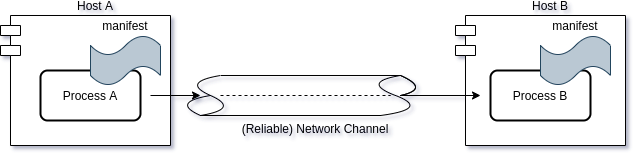

# Reliable Network Channels

Reliable, or deterministic **network channel** (*net_chan*) is a logical
construct that can be added to a distributed system to provide
deterministic and reliable connections. The core idea is to make it
simple to express the traffic for a channel in a concise, provable
manner and provide constructs for creating and using the channels.

In essence, a logical channel can be used as a local UNIX pipe between
remote systems.

A fundamental part of the reliability provided by net_chan is Time
Sensitive Networking (TSN) which is used to reserve capacity and guard
the data being transmitted. This is not to say that net_chan *require*
TSN, but without a hard QoS scheme, determinism cannot be guaranteed.

## Overall Design

**Net_chan** is intended to create a logical channel between to processes
running on different hosts in a network. The process need not run on
different hosts (but if you're on the same host, perhaps other means of
communicating is a better fit).

Conceptually, net_chan provide a channel that is undisturbed by outside
events such as other people using **your** network capacity. A channel
is used by a sender (often called *Talker* in TSN terminology) and one
or more receivers (*Listeners*). The data in the channel is sent in a
*stream*, again from TSN terminology and is just a sequence of network
packages that logically belong together (think periodic temperature
readings or from a microphone being continously sampled).



Central to all of this, is 'the Manifest' where all the streams are
listed.  Each stream is described using payload size, target
destination, traffic class, transmitting frequency and a unique ID. This
is then used by the core net_chan machinery to allocate buffers, start
receivers, reserve bandwidth etc.

```C
struct channel_attrs attrs[] = {
	{
		/* DEFAULT_MCAST */
		.dst       = {0x01, 0x00, 0x5E, 0x01, 0x02, 0x42},
		.stream_id = 42,
		.cs 	   = CLASS_A,
		.size      =  8,
		.freq      = 50,
		.name      = "mcast42",
	},
};
```

All participants in the distributed system will use the manifest to
configure the channels.

net_chan will compile a static library which can be used to link your
application. The project has a couple of examples, look at
[the meson build file](meson.build).


### Simple talker example
A talker (the task or process that **produces** data) need only 2 macros
from net_chan: namely
+ instantiate the channel locally
+ write data to channel

Note: this example is stripped of all excessive commands, includes
etc. Have a gander at [the talker](examples/talker.c) for the full example.
```C
int main(int argc, char *argv[])
{
	NETCHAN_TX(mcast42);
	for (int64_t i = 0; i < 10; i++) {
		WRITE(mcast42, &i);
		usleep(20000);
	}
	CLEANUP();
	return 0;
}
```

The examples directory also contains a sample listener to be used
alongside the talker example above.

## Build instructions

net_chan uses meson and ninja to build and details can be found in [the
meson build file](meson.build).

```bash
meson build
ninja -C build/
```

### Installing net_chan
To install, run ```meson install``` from within the build directory or
manually grab the generated files:
+ include/
+ build/libtimedavtp_avtp.a
+ build/libmrp.a


### Notes
Note: in the **very** near future, libtimedavtp_avtp.a will be renamed
along with a substantial rewrite of the API. The current naming-scheme
is the result of this project being initially targeted for Timed C, an
extension to C which adds time as a primitive. As net_chan is a more
generic construct, we aim to move this out from under the umbrella of
Timed C.

## Running tests

net_chan has a few unit-test written in
[Unity](http://www.throwtheswitch.org/unity), a lightweight C-framework
for tests that is reasonable small and (importantly) very fast. It does
require that an mrpd-daemon is running (see below). See
scripts/watch_builder.sh for how to set up tests to run.

A typical workflow consists of setting up watch_builder in one terminal
and watch the system kick into action when files are saved

```bash
./scripts/watch_builder.sh
~/dev/net_chan ~/dev/net_chan
. ./examples ./include ./include/srp ./src ./srp ./test ./tools
Setting up watches.
Watches established.

./ MODIFY README.md
ninja: Entering directory `build/'
ninja: no work to do.
ninja: Entering directory `/home/henrikau/dev/net_chan/build'
ninja: no work to do.
1/5 mrp                OK              0.26s
2/5 nh macro           OK              0.47s
3/5 pdu test           OK              0.88s
4/5 nh net fifo        OK              0.91s
5/5 nh test            OK              1.13s


Ok:                 5
Expected Fail:      0
Fail:               0
Unexpected Pass:    0
Skipped:            0
Timeout:            0

Full log written to /home/henrikau/dev/net_chan/build/meson-logs/testlog.txt
```

## Including Reliable Network Channels in other projects

The system builds 2 static libraries, one of which is a slightly
modified version of AvNUs mrp-client. This is kept separate to avoid
licensing issues. The other librarly (libnetchan.a) contains the
net_chan functionality.

The headers, apart from definig functions and #defines, also contains a
few helper-macros which is useful for testing the system. For a more
mature system, using the functions directly is recommended as you get a
bit more intuitive help from the compiler.

## Enabling TSN/AVB

To use TSN, a few components must be configured outside the project
### generalized Precision Timing Protocol (gPTP)

TSN relies on accurate timestamps and gPTP is a required
component. LinuxPTP is compatible with gPTP and comes with a gPTP config

```bash
sudo ptp4l -i enp2s0 -f gPTP.cfg -m
```

There's no need to run phc2sys as we will read the timestamp directly
from the network interface.

ptp4l can either be installed via your favorite package manager or
cloned and built locally.
```bash
git clone git://git.code.sf.net/p/linuxptp/code linuxptp
cd linuxptp/
make
sudo make install
```

### Stream Reservation
A key feature of net_chan is the ability to reserve bandwidth and buffer
capacity through the network (provided the network supports TSN). This
is done using the stream reservation protocol (SRP) and AvNU has an
excellent project (OpenAvnu) to support this. In this project, the
*mrpd* daemon must be built and started locally *on each
machine*. net_chan comes with the client-side of AvNUs mrp code,
slightly tailored and adapted for our need (this can be found in the
srp/ subfolder). This allows net_chan to communicate with the
mrpd-daemon and send reservations, receive subscribe requests etc.

```bash
git clone github.com:Avnu/OpenAvnu.git
cd OpenAvnu
make mrpd
```

Once started, the dameon will then listen on a localhost port
awaiting clients to connect before sending the required SRP messages to
the network.

```bash
sudo ./daemons/mrpd/mrpd -i enp2s0 -mvs
```

#### Enabling SRP
To instruct net_chan to attach to the srp daemon and reserve bandwidth
and buffers, the startup-section of your code must contain calls to
```nc_use_srp();```. This will cause net_chan to hook into the
mrp-client library and ensure that the stream is properly protected. In
a network with other noise, this has a very noticable effect.
